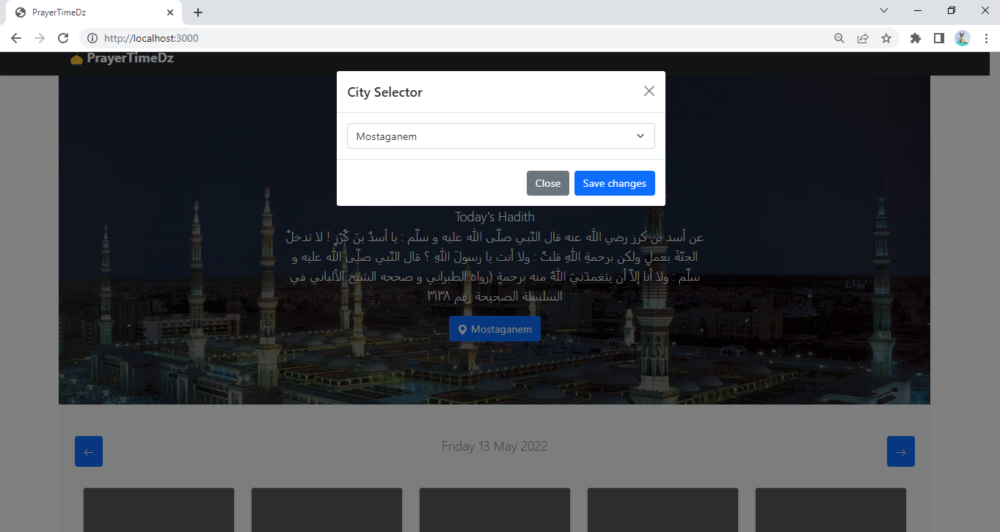

# Alos Activity 4

## Introduction

This is an updated version of Alos Activity 3.

The FrontEnd was created without the use of React.

made up of only Vanilla HTML, CSS, Bootstrap, and JS.

Dockerized The FrontEnd and the API

.dockerignore ignores node modules

## Screenshots
screenshot of the FrontEnd




## Requirements
Node.js

Express

Express-validator

Mocha

Chai

Passport

JWT (JSON Web Token)

## how to use 

run the server by typing in the terminal:

``` npm start ```

then

```npm install```

then go to the url:

``` http://localhost:3000 ```


## API V2

list of all the endpoints:
```/auth/login```  login

```/auth/signup```  end point for making new accounts 

```/auth/signin``` end point for using credentails to signi

```/auth/signout``` end point for signing out 

```/hisnulmuslim``` queries a database of hadith an doua


```/prayertime/v2/:wilaya/```
this endpoint will return the prayer times for a given wilaya for all generated times in prayertimeDB.

```/prayertime/v2/:wilaya/:date```
this endpoint will return the prayer times for a given wilaya for a given date.

```/prayertime/v2/:wilaya/:date/:year```
this endpoint will return the prayer times for a given wilaya for a given date and year.

```/prayertime/v2/:wilaya/:date/:year/:month```
this endpoint will return the prayer times for a given wilaya for a given date, year and month.

```/prayertime/v2/:wilaya/:date/:year/:month/:day```
this endpoint will return the prayer times for a given wilaya for a given date, year, month and day.

```/prayertime/v2/:wilaya/:date/:year/:month/:day/:eventname```
this endpoint will return the prayer times for a given Wilaya for a given date, year, month, day and eventname.
valid event-names are:
imsak,fajr,sunrise,dhuhr,asr,sunset,maghrib,isha


## API V1

list of all the endpoints:

```/prayertime/v1/:wilaya/```
this endpoint will return the prayer times for a given wilaya for all generated times in prayertimeDB.

```/prayertime/v1/:wilaya/:date```
this endpoint will return the prayer times for a given wilaya for a given date.

```/prayertime/v1/:wilaya/:date/:year```
this endpoint will return the prayer times for a given wilaya for a given date and year.

```/prayertime/v1/:wilaya/:date/:year/:month```
this endpoint will return the prayer times for a given wilaya for a given date, year and month.

```/prayertime/v1/:wilaya/:date/:year/:month/:day```
this endpoint will return the prayer times for a given wilaya for a given date, year, month and day.

```/prayertime/v1/:wilaya/:date/:year/:month/:day/:eventname```
this endpoint will return the prayer times for a given Wilaya for a given date, year, month, day and eventname.
valid event-names are:
imsak,fajr,sunrise,dhuhr,asr,sunset,maghrib,isha


## Example

```/prayertime/mostaganem/2022/04/02```
will return 

```
{
[
   {
      "imsak":"05:08",
      "fajr":"05:18",
      "sunrise":"06:45",
      "dhuhr":"13:03",
      "asr":"16:38",
      "sunset":"19:22",
      "maghrib":"19:22",
      "isha":"20:44",
   }
]
}
```

```/prayertime/mostaganem/2022/04/02/magrib```
will return 

```
{
   "maghrib":"19:22"
}
```
